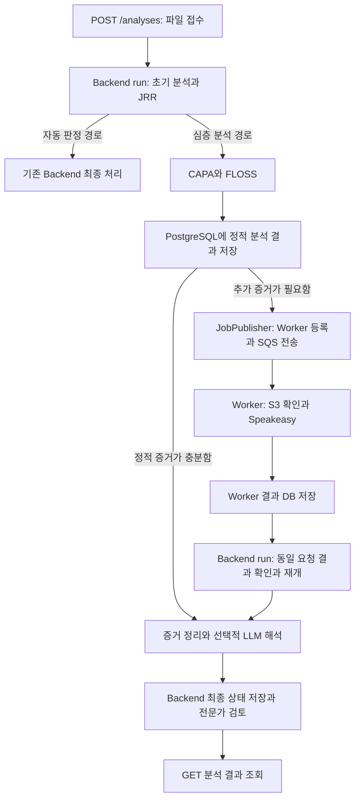

# Backend → Worker → 결과 반영

이 브랜치는 SQS Worker뿐 아니라 요청 등록과 결과 수신·재개도 포함한다. Backend의 기존 `ExistingDeepGateway`가 `deep_analysis.service_runtime`을 로드하고 `DeepAnalysisService.register()`·`resume()`·`get()`을 호출한다. 웹 요청은 접수·조회만 수행하고 `backend_api run`이 분석을 진행한다.



## 처리와 재시작

`deep_analysis_runs`는 심층 분석의 체크포인트를, `speakeasy_jobs`는 Speakeasy 작업을, `api_analyses`는 전체 분석 상태를 관리한다. 모두 같은 `analysis_id`·SHA-256·원본 위치를 사용한다.

| Deep Analysis 단계 | 수행하는 일 |
| --- | --- |
| `STATIC` | S3 원본 확인, 기존 CAPA/FLOSS 호출, 결과·증거·정책 식별자 저장 |
| `WAITING_SPEAKEASY` | 필요한 작업만 SQS에 전송, Worker 결과 대기 |
| `FINALIZING` | Worker 결과 검증·복사, 누적 증거 정규화·선택적 LLM 해석 |
| `COMPLETED` / `FAILED` | 심층 분석 종료. Backend가 결과를 받아 전체 상태와 최종 처리 제안을 저장 |

정적 분석 체크포인트는 SQS 전송보다 먼저 commit한다. 전송 실패는 `dispatch_pending`에서 복구한다. 재시작·반복 polling 시 정적 분석과 완료 Worker 작업을 반복하지 않는다. 결과 저장 재시도에서는 계산된 결과를 재사용한다. 체크포인트 저장 전 강제 종료나 저장 재시도 소진으로 외부 도구 호출이 다시 발생할 가능성까지 없애는 exactly-once 보장은 제공하지 않는다.

Worker 결과의 분석 번호·해시·단계·상세 도구 상태·산출물 참조를 검증하고, 전체 결과를 체크포인트에 복사한다. 이후 Worker 행을 다시 조회하지 않아도 저장된 증거를 읽을 수 있다. 원본 정리는 Deep Analysis와 Worker가 모두 종료했는지 확인한 뒤 Backend 보관 정책으로 처리한다.

## 실행 절차

Backend 서버에는 기존 모델·Feature 산출물과 CAPA/FLOSS 실행 파일이 필요하다. Worker 서버에는 Speakeasy 실행 환경이 필요하다. 아래는 가상환경을 설치한 저장소 루트 기준이다.

```powershell
$workerPython = ".\trust-triage-env\Scripts\python.exe"
& $workerPython -m pip install -r requirements-backend-analysis.txt -r requirements-deep-analysis.txt
& $workerPython -m pip install -e . --no-deps
```

Backend 서버의 [.env.backend.example](../../.env.backend.example)을 기준으로 실제 `.env`를 준비한다. `BACKEND_STORAGE_MODE=s3`와 DB·S3·모델 경로를 지정하고, 심층 분석 항목에 SQS/DLQ URL과 CAPA/FLOSS 경로를 넣는다. 별도 Worker의 [.env.worker.example](../../.env.worker.example)에는 동일한 DB·버킷·접두사·SQS URL을 지정한다. 실제 비밀값은 Git에 저장하지 않는다.

```powershell
# Backend 서버: 최초 초기화 및 설정 검사
& $workerPython -m trust_triage.backend_api --env-file .env init-db --deep
& $workerPython -m trust_triage.backend_api --env-file .env check --analysis --deep

# 터미널/프로세스 1: HTTP
& $workerPython -m trust_triage.backend_api --env-file .env serve

# 터미널/프로세스 2: 초기 분석, CAPA/FLOSS, 요청 전송, 결과 재개와 최종 처리
& $workerPython -m trust_triage.backend_api --env-file .env run

# Worker 서버의 별도 프로세스 3: Worker용 .env 사용
& $workerPython -m trust_triage.speakeasy_worker --env-file .env check
& $workerPython -m trust_triage.speakeasy_worker --env-file .env run
```

Backend에 연결된 요청은 위 세 프로세스로 진행한다. `deep_analysis run`을 추가로 띄울 필요는 없다. 별도 시스템에서 Deep Analysis를 직접 호출하는 경우에는 `python -m trust_triage.deep_analysis`의 `start`·`resume`·`run` 명령을 사용할 수 있다.

`/docs`에서 파일을 접수하고 `/analyses/{analysis_id}/status`, `/deep-analysis`, 상세 분석 결과로 진행을 조회할 수 있다. `run --once`는 한 회차를 처리하므로 전체 완료를 위해서는 여러 단계가 필요하다. GET 조회 자체는 작업을 보내거나 도구·LLM을 실행하지 않는다.

## 현재 정책과 검증 범위

초기 자동 정상·악성 경로는 Worker를 호출하지 않는다. 심층 분석 대상도 CAPA/FLOSS 증거가 충분하면 Worker를 건너뛴다. Worker가 필요하면 종료 결과까지 기다려 증거에 반영한다. 분석 실패·시간 초과는 악성 판정으로 취급하지 않는다.

LLM은 기존 해석기를 선택적으로 호출하며 미설정·실패 시에도 증거와 도구 상태를 보존한다. Backend의 현재 정책은 심층 분석 대상을 `UNCERTAIN / MANUAL_REVIEW`로 전문가에게 넘긴다. 심층 분석 실패 시에는 `UNCERTAIN / ANALYSIS_FAILED`를 기록한다. LLM의 정상·악성 해석을 자동 확정하지 않으며, JRR 자동 재판정·최종 자동 판정 정책을 새로 정한 변경은 아니다.

연결 테스트는 실제 HTTP 경계·런타임·Gateway·SQS 어댑터·Worker·저장소 코드와 PostgreSQL을 사용한다. 초기 모델과 분석 도구, LLM, 클라우드 클라이언트는 대역으로 바꾸고 실행 코드가 없는 기존 헤더 fixture만 사용한다. 실제 AWS/RDS·분석 도구·승인된 PE의 배포 환경 검증은 남아 있다. 상세 결과는 [검증 기록](verification.md)에 남긴다.
